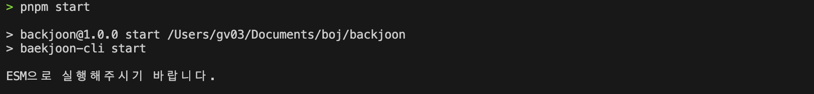

# 백준 JS 자동 IO 포멧팅

---

> 아쉽게도 **CommonJS**는 지원하지 않습니다.
>
> **"ESM으로 실행해주시기 바랍니다."** 와 같은 문구가 나온다면 아래와 같이 설정하여 이용해주시기 바랍니다.
>
> 

```js
// package.json
{
	type: 'module';
}
```

## 소개

자바스크립트로 백준 문제 푸실때 IO 를 직접 입력하실 필요 없습니다.

자동으로 세팅해드리겠습니다.

<span style="color:red">**성능 측정은 불가하니 확실한 정답확인은 백준 사이트에서 확인하시기 바랍니다.**</span>

## Install

### npm

```sh
npm install --save-dev baekjoon-js-cli
```

#### yarn

```sh
yarn add --dev baekjoon-js-cli
```

#### pnpm

```sh
pnpm install --save-dev baekjoon-js-cli
```

## use

```sh
npx baekjoon-cli start
```

## 데모영상


